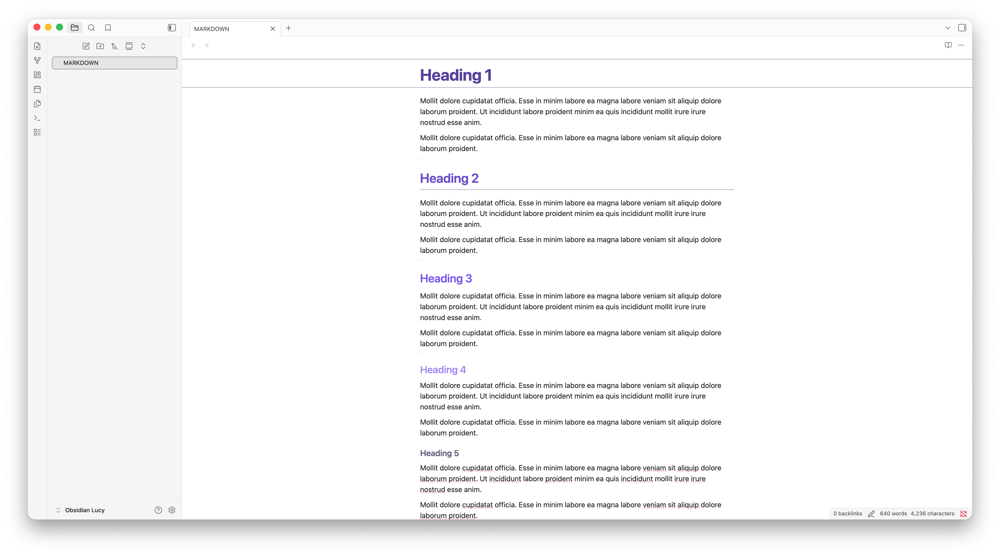
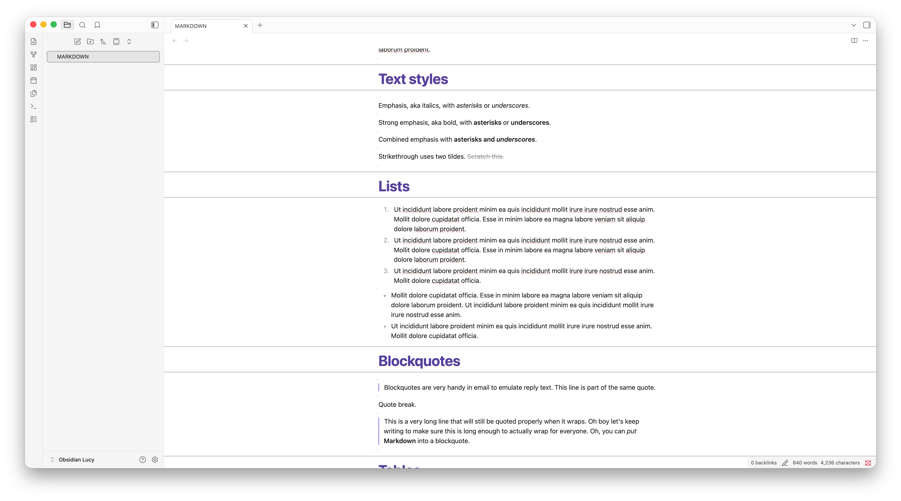
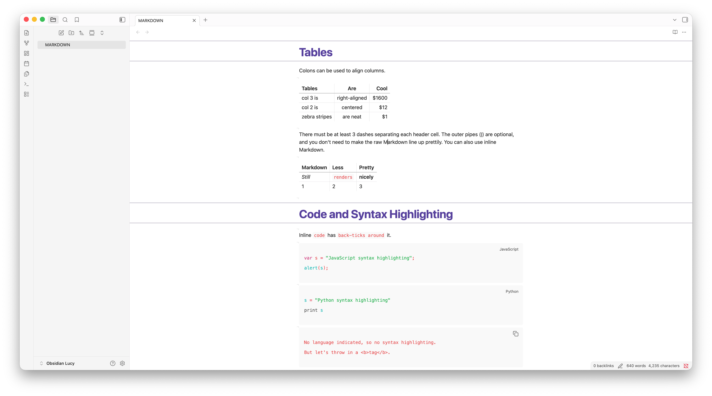

# Lucy

A clean, spacious, Notion-inspired theme designed for clear thinking in [Obsidian](https://obsidian.md).

---

## ✨ Features

Lucy is designed to remove visual noise, leaving you with a calm, well-structured digital canvas that feels like Notion but runs locally.

### 🧘 Distraction-Free Workspace

- **Auto-Hiding Document Titles**: The note title container fades away to `0` opacity and smoothly transitions back only when focused (`:focus-within`), giving you a clean header line.
- **Low-Contrast Markdown Formatting**: Formatting markers (such as `#`, `**`, `*`, `~~`, `==`, `` ` ``) are styled in a semi-transparent, subtle color. They fade into the background, highlighting only the parsed text.

### 📐 Elegant Document Hierarchy

- **Full-Viewport H1 Accent Lines**: Section headers (H1) feature top and bottom border accent lines. In Live Preview, these lines stretch edge-to-edge across the viewport for a structured, editorial feel.
- **Bordered H2 Headers**: H2 elements include a clean underline border to clearly demarcate secondary sections.
- **Refined Heading Palette**: Headings scale proportionally from H1 down to H6 with distinct color weights customized for both dark and light modes.

### 🎨 Notion-Inspired Colors

- **Light Mode**: Features a clean base with a premium royal purple/deep indigo accent (`rgb(65, 37, 131)`). Default callouts, info callouts, and todo checkboxes adapt this deep indigo hue.
- **Dark Mode**: Employs a soft, steel-blue palette with high contrast, light-blue headers for exceptional legibility during night writing.

### 🔗 Connected Blockquotes

- Consecutive blockquote paragraphs visually connect their left borders, preventing disjointed blocks and creating a cohesive container for quoted text.

### 📝 Refined Lists & Layout Spacing

- **3-Level Bullet Cycling**: Bullets dynamically cycle their shape depending on indentation depth (Level 1: filled disc, Level 2: hollow circle, Level 3: filled square), looping every 3 levels.
- **Optimal Spacing**: Generous line spacing and compact list items (`2px` vertical padding) strike the perfect balance between readability and density.
- **Empty Line Indicators**: Blank lines are optimized to `8px` height to save vertical space, displaying a subtle caret guide (`¬`) on the left to indicate line breaks without cluttering your view.

---

## 🚀 Installation

### Option 1: Community Themes (Recommended)

1. Open **Settings** in Obsidian.
2. Navigate to **Appearance** → **Themes** → **Manage**.
3. Search for **Lucy**.
4. Click **Install and use**.

### Option 2: Manual Installation

1. Download `theme.css` and `manifest.json` from the latest release.
2. In Obsidian, go to **Settings** → **Appearance** → **Themes** and click the **Folder** icon to open your themes directory.
3. Create a folder named `Lucy`.
4. Copy `theme.css` and `manifest.json` into the `Lucy` folder.
5. In Obsidian, select **Lucy** from the themes dropdown.

---

## 🛠️ Development & Releases

If you're modifying or contributing to the theme:

1. Clone this repository into your vault's theme folder: `.obsidian/themes/Lucy`
2. Run your developer tools or editor of choice. All styling is configured directly in `theme.css`.
3. To draft a new version:
   - Update the version number in `manifest.json`.
   - Add the version mapping to `versions.json`.
   - Push a new [GitHub Release](https://github.com/gabrielbacha/Obsidian-Lucy/releases) with `manifest.json` and `theme.css` attached.

---

## 📄 License

This project is licensed under the MIT License - see the [LICENSE](LICENSE) file for details.

