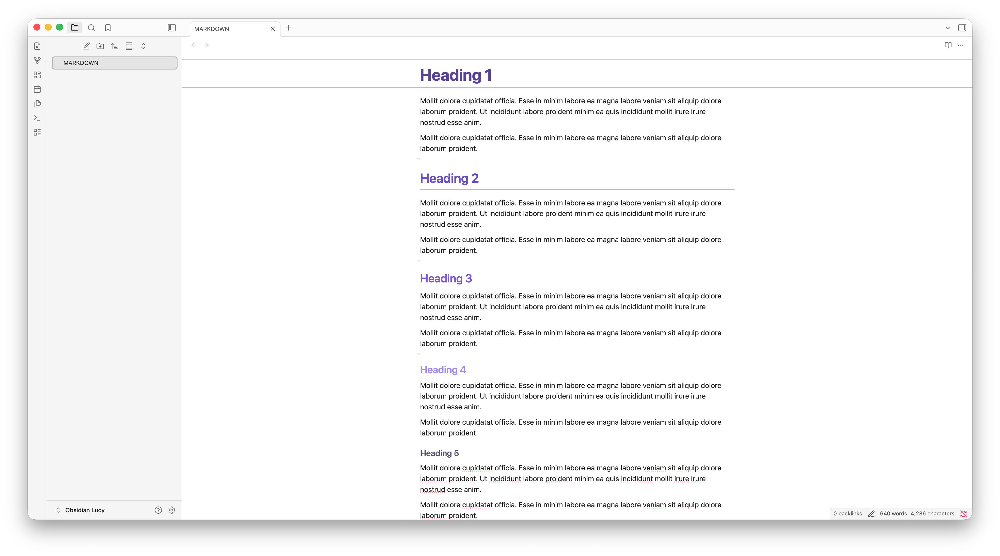

# Heading 1 — Editorial rule and a deliberately long title that can wrap

Lucy is a clean, spacious theme designed for clear thinking. This paragraph is long enough to verify the readable line width, text wrapping, line height, and paragraph rhythm in both light and dark appearances.

This second paragraph checks the separation between consecutive body blocks. It contains a [regular link](https://typora.io), **strong emphasis**, *emphasis*, ***combined emphasis***, ~~strikethrough~~, ==highlighted text==, `inline code`, H~2~O, and x^2^.


The extra blank lines above verify Lucy's compact empty-line treatment and subtle `¬` editing guides.

## Heading 2 — Bordered section

The H2 underline should span the readable document width without affecting the paragraph below it.

### Heading 3

Heading three uses the strongest accent color.

#### Heading 4

Heading four is slightly smaller and quieter.

##### Heading 5

Heading five blends the accent into the neutral text palette.

###### Heading 6

Heading six closes the hierarchy while remaining distinct from body copy.

# Text styles

Formatting markers should remain subdued while the text itself stays legible. This sentence includes <kbd>⌘</kbd> + <kbd>K</kbd>, an automatic URL <https://typora.io>, and an HTML comment immediately after it.

<!-- Lucy renders Typora HTML comments as a compact highlighted annotation. -->

## Lists

1. First ordered item with enough text to wrap onto a second line and reveal marker alignment.
2. Second ordered item.
   1. Nested ordered item.
   2. Another nested ordered item.
3. Third ordered item.

- Level one uses a filled disc.
  - Level two uses a hollow circle.
    - Level three uses a filled square.
      - Level four returns to a filled disc.
        - Level five returns to a hollow circle.
          - Level six returns to a filled square.
- A second top-level item verifies vertical rhythm.

- [ ] Unfinished task
- [x] Completed task

## Blockquotes

> A blockquote with two paragraphs should read as one connected block.
>
> The border remains continuous when the quote wraps across several lines. **Markdown** inside the quote remains fully styled.

> This adjacent blockquote verifies the connection between consecutive quote blocks.

> A final quote contains a nested quote.
>
> > Nested quotation level.

## Alerts

> [!NOTE]
> Lucy maps Typora's note alert to the theme accent.

> [!IMPORTANT]
> Important content remains readable without introducing another dominant accent.

> [!WARNING]
> Alert structure stays native to Typora.

## Tables

| Markdown | Less | Pretty |
| :--- | :---: | ---: |
| Still | `renders` | nicely |
| Row two | centered | $12 |
| Zebra-free | subtle hover | $1,600 |

## Code and syntax highlighting

Inline `code` uses Lucy's red code color.

```javascript
const message = "Lucy syntax highlighting";
console.log(message);
```

```python
def greet(name: str) -> str:
    """Return a calm greeting."""
    return f"Hello, {name}"
```

```
No language is specified in this code fence.
```

## Math

Inline math uses $E = mc^2$.

$$
\int_{-\infty}^{\infty} e^{-x^2}\,dx = \sqrt{\pi}
$$

## Images and horizontal rules



---

The horizontal rule and image complete the main document-element fixture.
